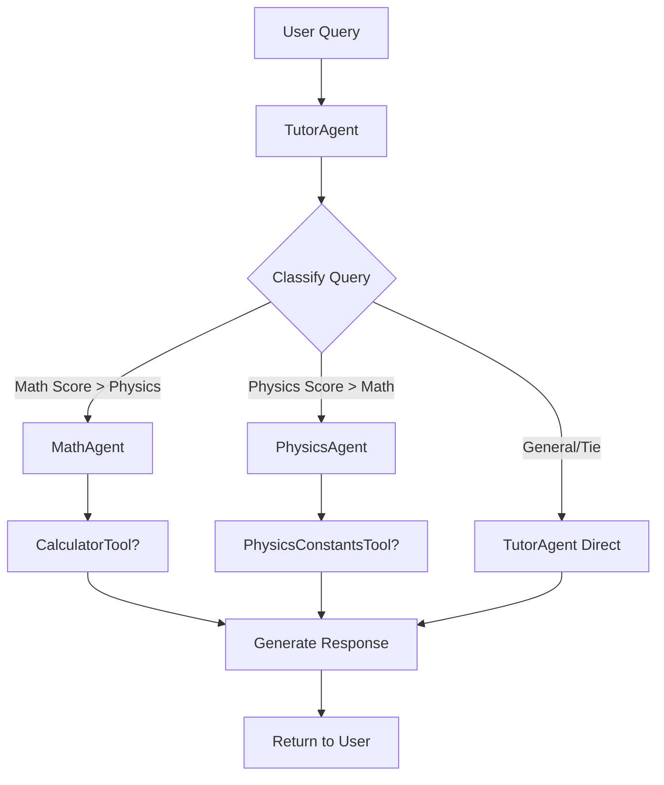

# 🎓 AI Tutor Multi-Agent System

A sophisticated AI-powered tutoring platform that uses multiple specialized agents to provide comprehensive educational support in mathematics, physics, and general learning. Built with FastAPI backend and Next.js frontend, deployed on Railway and Vercel.


## 🌟 Features

- **Multi-Agent Architecture**: Specialized agents for different domains
- **Smart Query Routing**: Intelligent classification and delegation
- **Real-time Calculations**: Built-in calculator and physics tools
- **Modern UI**: Beautiful, responsive interface with dark mode
- **Production Ready**: Deployed on Railway (backend) and Vercel (frontend)

## 🏗️ System Architecture

### Agent Hierarchy

```
TutorAgent (Main Orchestrator)
├── MathAgent (Specialized for Mathematics)
│   └── CalculatorTool
├── PhysicsAgent (Specialized for Physics)
│   └── PhysicsConstantsTool
└── General Tutoring (Handled directly by TutorAgent)
```

## 🤖 Agents Overview

### 1. TutorAgent (Main Orchestrator)
The central coordinator that:
- **Routes queries** to appropriate specialized agents
- **Classifies user input** using keyword analysis and pattern matching
- **Handles general tutoring** questions directly
- **Manages conversation flow** and agent coordination

**Key Features:**
- Advanced query classification with scoring system
- Pattern recognition for mathematical and physics expressions
- Tie-breaking logic for ambiguous queries
- General educational support for non-specialized topics

**Classification System:**
```python
# Example scoring
Math Keywords: calculate, solve, algebra, +, -, *, /, sin, cos, etc.
Physics Keywords: force, energy, newton, velocity, wave, etc.
Patterns: Mathematical expressions (2+3), Physics formulas (F=ma)
```

### 2. MathAgent
Specialized agent for mathematical problems and concepts:

**Capabilities:**
- **Arithmetic Operations**: Basic calculations (addition, subtraction, multiplication, division)
- **Advanced Functions**: Trigonometric functions (sin, cos, tan)
- **Mathematical Concepts**: Algebra, calculus, geometry explanations
- **Formula Evaluation**: Complex mathematical expressions

**Tools Used:**
- `CalculatorTool`: Safe mathematical expression evaluation

**Example Queries:**
- "Calculate 2 + 3 * 4"
- "What is the derivative of x²?"
- "Solve the equation 2x + 5 = 15"
- "Explain the concept of limits in calculus"

### 3. PhysicsAgent
Specialized agent for physics problems and concepts:

**Capabilities:**
- **Physics Calculations**: Force, energy, motion problems
- **Constants & Units**: Physical constants and unit conversions
- **Concept Explanations**: Physics principles and laws
- **Real-world Applications**: Practical physics examples

**Tools Used:**
- `PhysicsConstantsTool`: Access to physical constants and conversions

**Example Queries:**
- "What is the speed of light?"
- "Calculate kinetic energy of a 10kg object moving at 5m/s"
- "Explain Newton's second law"
- "What is the gravitational constant?"

## 🛠️ Tools System

### Base Tool Architecture
All tools inherit from `BaseTool` class:
```python
class BaseTool(ABC):
    def __init__(self, name: str, description: str)
    async def execute(self, *args, **kwargs) -> ToolResult
```

### CalculatorTool
**Purpose**: Safe mathematical expression evaluation
**Security Features:**
- Restricted namespace (no dangerous functions)
- Input validation and sanitization
- Protection against code injection

**Supported Operations:**
- Basic arithmetic: `+`, `-`, `*`, `/`, `^`, `**`
- Functions: `sin()`, `cos()`, `tan()`, `sqrt()`, `log()`, `abs()`
- Constants: `pi`, `e`

### PhysicsConstantsTool
**Purpose**: Access to physics constants and unit conversions
**Features:**
- Physical constants database
- Unit conversion capabilities
- Contextual constant suggestions

## 🧠 AI Integration

### Google Gemini API
- **Model**: `gemini-2.0-flash`
- **Configuration**: Temperature, max tokens customizable
- **Error Handling**: Comprehensive retry and fallback mechanisms

### System Prompts
Each agent uses specialized system prompts:
- **Math Agent**: Step-by-step mathematical reasoning
- **Physics Agent**: Real-world applications and formulas
- **Tutor Agent**: Educational guidance and concept explanation

## 📡 API Endpoints

### Core Endpoints
```
POST /api/chat          # Main chat interface
GET  /api/agents        # Agent information and capabilities
GET  /api/health        # System health check
GET  /health           # Simple health endpoint
GET  /                 # Root endpoint with system info
```

### Request/Response Models
```python
# Chat Request
{
    "message": "string",
    "conversation_id": "optional_string"
}

# Chat Response
{
    "response": "string",
    "agent_used": "tutor|math|physics",
    "conversation_id": "string",
    "metadata": {
        "tools_used": ["tool_names"],
        "confidence": 0.0-1.0,
        "agent_metadata": {}
    }
}
```

## 🎨 Frontend Features

### Modern UI Components
- **Enhanced Chat Interface**: Beautiful conversation UI
- **Dark/Light Mode**: User preference toggle
- **Real-time Status**: Backend connection indicator
- **Loading Animations**: Smooth user experience
- **Error Handling**: Graceful error display

### Technologies
- **Framework**: Next.js 15 with TypeScript
- **Styling**: Tailwind CSS
- **HTTP Client**: Axios with interceptors
- **Icons**: Lucide React
- **Markdown**: React Markdown for rich content

## 🚀 Deployment

### Backend (Railway)
```json
{
  "build": { "builder": "nixpacks" },
  "deploy": {
    "startCommand": "uvicorn main:app --host 0.0.0.0 --port $PORT",
    "healthcheckPath": "/health"
  }
}
```

### Frontend (Vercel)
- **Framework**: Auto-detected Next.js
- **Environment Variables**: `NEXT_PUBLIC_API_URL`
- **Build Command**: `npm run build`
- **Deploy Trigger**: Git push to main branch

### Environment Variables
**Backend (Railway):**
- `GEMINI_API_KEY`: Google Gemini API key
- `FRONTEND_URL`: Vercel deployment URL
- `PORT`: Auto-set by Railway

**Frontend (Vercel):**
- `NEXT_PUBLIC_API_URL`: Railway backend URL

## 🔧 Local Development

### Backend Setup
```bash
cd backend
python -m venv .venv
source .venv/bin/activate  # Windows: .venv\Scripts\activate
pip install -r requirements.txt
uvicorn main:app --reload
```

### Frontend Setup
```bash
cd frontend
npm install
npm run dev
```

### Environment Configuration
Create `.env.local` in frontend:
```env
NEXT_PUBLIC_API_URL=http://localhost:8000
```

Create `.env` in backend:
```env
GEMINI_API_KEY=your_gemini_api_key_here
```

## 📊 Query Classification Flow



## 🔒 Security Features

### Input Validation
- **Expression Sanitization**: Remove dangerous patterns
- **Keyword Filtering**: Block harmful operations
- **Type Checking**: Ensure proper data types

### Safe Execution
- **Restricted Namespaces**: Limited function access
- **Error Handling**: Graceful failure modes
- **CORS Protection**: Controlled origin access

## 📈 Performance Optimization

### Caching
- **Tool Results**: Cache frequent calculations
- **Agent Responses**: Session-based caching
- **Static Assets**: CDN optimization

### Error Recovery
- **Retry Logic**: Automatic API retry
- **Fallback Responses**: Graceful degradation
- **Health Monitoring**: System status tracking

## 🧪 Testing

### Agent Testing
```bash
cd backend
python test_agents.py
```

### Manual Testing Queries
- **Math**: "Calculate 2^3 + sqrt(16)"
- **Physics**: "What is the speed of light in m/s?"
- **General**: "Explain the concept of photosynthesis"

## 🚀 Future Enhancements

### Planned Features
- [ ] More specialized agents (Chemistry, Biology)
- [ ] Enhanced tool ecosystem
- [ ] User authentication and progress tracking
- [ ] Advanced visualization tools
- [ ] Mobile application
- [ ] Voice interaction support

### Scalability Improvements
- [ ] Agent load balancing
- [ ] Database integration for conversation history
- [ ] Advanced caching strategies
- [ ] Performance monitoring and analytics
